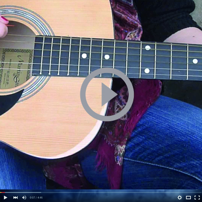

<!doctype html>
<html class="no-js" lang="en">
  <head>
    <meta charset="utf-8" />
    <meta http-equiv="x-ua-compatible" content="ie=edge">
    <meta name="viewport" content="width=device-width, initial-scale=1.0" />
    <title>Rachel Cunningham -  website</title>
    <link rel="stylesheet" href="css/foundation.min.css" />
    <link rel="stylesheet" href="css/style.css" />
    <link href="https://fonts.googleapis.com/css?family=Amatic+SC|Raleway" rel="stylesheet">
  </head>
  <body id="top">

  

        

        <a href="index.html"><h1 id="index" >Rachel Cunningham</h1></a>

     
       
        
<!-- End Div -->
        

         <ul id="navigation">
            <li><a href="#contact">Contact</a></li>
            <li><a href="#about">About</a></li>
            <li><a href="#portfolio">Portfolio</a></li>
            <li><a href="#index.html" class="active">Home</a></li>
          </ul>
        
<!-- End Div -->
      

    

      
      

    

        

            
        
<!-- End Div -->
    

      
      

        

        
        
      

      

    
    
    
    

        

            <h3 id="about"> <b>A little bit about me...</b></h3>
         
 <b>Hey there!</b> My name is Rachel, I love all things artistic. My life is design orientated &amp; I spend most of my time trying to develop my skills further.
             
            I consider my skill set to be Graphic Design, Illustration and Typography   

For the past two years I have been working as a freelance 
designer and have worked with clients such as: Trespass, PSNI and Northern Regional College.  

I am about to complete a Foundation Degree in Interactive Media in Belfast. When I’m not studying, I enjoy creating handcrated 
typography, sketching and creating portrait illustrations of people.  

I see my future doing the things I love; designing, illustrating and broadening my skills in branding. I love challenging myself and 
keeping up with the constant changing trends of this industry.   
            
Send me an email, lets chat... we can work together and create something great! 
        
        

            
             
             
          
         
        
            
            
          
          
            
    
        

      

      
      

      
      
      
<!--about-->     
<!--portfolio-->
      
      

          

        <h1 id="portfolio"><b>Portfolio...</b></h1>
        <h2>A selection of the work I have created during my Foundation Degree, I have developed my ideas and enhanced my skills throughout the creation of these projects 
                Click the images to see more...</h2>
              
       

       
       

       
        

                <h1><b>Videos...</b></h1>
        
        

        
        

                <h1><b>Logos...</b></h1>
        
        

    
           

                <h1><b>Typography...</b></h1>
                
           

       
       
        

                <h1><b>Illustration...</b></h1>
                 
        

       
        

                <h1><b>Barbershop...</b></h1>
               
        

           
           

                <h1><b>Prints...</b></h1>
        
       

       
    
    

    

      
<!--contact --> 
      
      

      
      
      
      

        

        <h2 id="contact" ><b>Lets Chat...</b></h2>
           

      

      
      
      

                <form name="htmlform" method="post" action="rachelc16196@gmail.com.com">
                        <input class="textbox" type="text" name="first_name" placeholder="NAME" required>
                        <input class="emailbox" type="email" name="email" placeholder="E-MAIL" required>
                        <textarea class="messagebox" name="comments" placeholder="MESSAGE" required></textarea>
                        <button name="send" type="sumbit" class="submit"> </button>
                </form>
          
<!-- End Div Contact-Form -->

      
<!--footer-->      
    

      
      
      

        

          
        

           
           

               
        

           
           

           
        

           
           

          
        

           
           

               
        

           
           

           
        

  
      
      

      
      
      
      
      
      
    

        
 
        

    

    
  

    
    
    
    
  </body>
</html>

